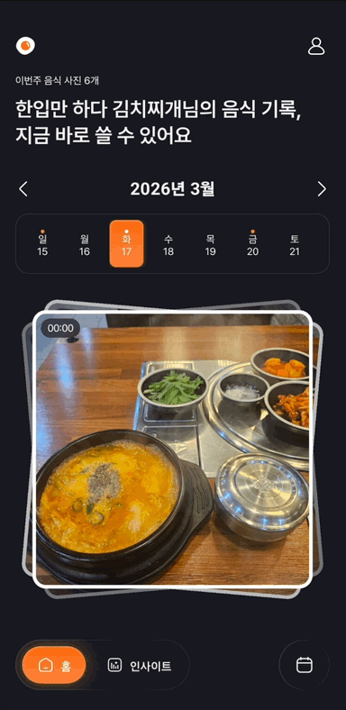
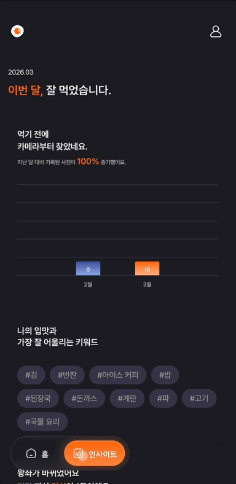
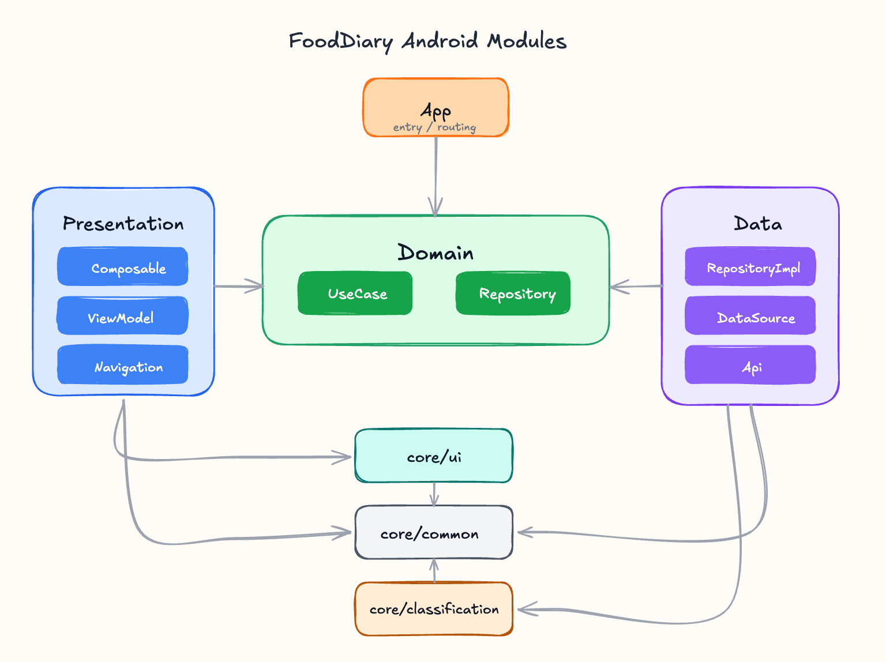

<div align="center">
    <br>
    
    <br>
    <a href="https://play.google.com/store/apps/details?id=com.nexters.fooddiary">Google Play에서 보기</a>
</div>


## 🍳 뭐먹었지?

식사를 특별하게. 오늘 뭐 먹었는지 기록하고, 나만의 식사 패턴을 발견해보세요.

사진 한 장으로 식사를 남기고, 캘린더와 인사이트로 기록을 다시 돌아볼 수 있는 푸드 다이어리 Android 앱입니다.

#### 📸 음식 기록하기

사진과 함께 먹은 장소, 메모를 남겨 나만의 푸드 다이어리를 완성해보세요.

AI 기반 음식 분석으로 기록 과정을 더 빠르고 편하게 이어갈 수 있어요.

#### 📅 캘린더로 보기

주간, 월간 캘린더로 한눈에 내 식사 기록을 확인할 수 있어요.

기록한 식사를 날짜 흐름에 따라 모아보며 나만의 루틴을 쉽게 파악할 수 있어요.

#### 📊 인사이트

주차별 통계와 위치 기반 분석으로 나의 식습관을 되돌아보세요.

쌓인 기록을 바탕으로 자주 먹는 메뉴, 많이 방문한 장소, 월간 변화도 확인할 수 있어요.

## 🎞️ Interaction

<div align="center">
    
    
</div>

## 💻 Environment

- Android 8.0 (API 26) ~
- JDK 17 ~
- Kotlin 2.2.21 ~

## ⚒️ Tech Spec

### Architecture

- Clean Architecture
- Multi Module
- Mavericks 기반 상태 관리

### DI

- Hilt

### UI

- Jetpack Compose
- Material 3
- Navigation Compose
- Coil
- Kizitonwose Calendar
- Haze

### Async Programming

- Kotlin Coroutines
- Flow

### Data

- Retrofit
- OkHttp
- Kotlinx Serialization
- Room
- DataStore

### Image / ML

- LiteRT
- ExifInterface

## 🗂️ Project Structure

```text
FoodDiary-Android
├── app
├── core
│   ├── common
│   ├── ui
│   └── classification
├── data
├── domain
└── presentation
    ├── auth
    ├── detail
    ├── home
    ├── image
    ├── insight
    ├── modify
    ├── mypage
    ├── onboarding
    ├── search
    ├── splash
    ├── webview
    └── widget
```

## 🧩 Module Architecture

<div align="center">
    
</div>

## 🚀 Getting Started

### local.properties 설정

아래 값들을 로컬 환경에 맞게 준비해주세요.

```properties
sdk.dir=/path/to/Android/sdk
api.base.url=https://your-api-base-url
web.client.id=your-web-client-id

# Optional
sentry.dsn=your-sentry-dsn
```

## 🔗 Other Repository

- [FoodDiary-iOS](https://github.com/Nexters/FoodDiary-iOS)
- [FoodDiary-BE](https://github.com/Nexters/FoodDiary-BE)
